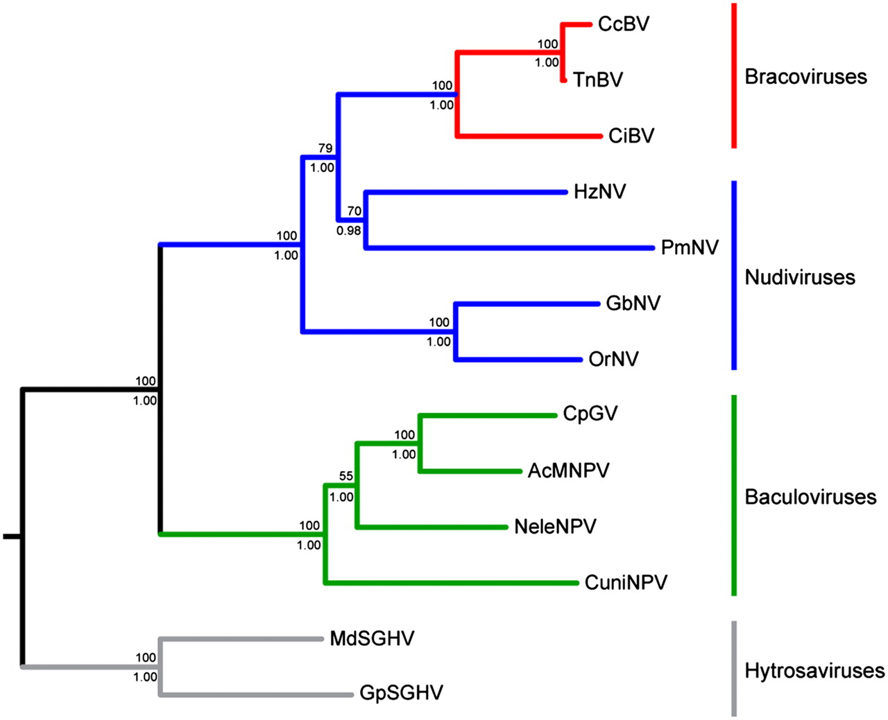

# Polilla militar tardía

El gusano cogollero del maíz (*Spodoptera frugiperda J. E. Smith*, Lepidoptera: Noctuidae), también conocido como oruga militar tardía, es una plaga polífaga altamente destructiva que ataca una gran variedad de cultivos, entre ellos el algodón, maíz, soja, sorgo y caña de azúcar (@cita). El mayor daño es producido por los estadios larvales debido a su gran consumo de follaje y de brotes, lo que limita el crecimiento del cultivo, principalmente durante las etapas vegetativa avanzada y reproductiva (@cita). Es una especie altamente invasiva y puede cubrir largas distancias gracias a sus fuertes capacidades de vuelo (@cita).

Si bien es una especie endémica del continente americano, recientemente se ha expandido hacia Africa y Asia, despertando preocupación sobre su posible impacto agronómico en estas regiones (@cita). Basados en estimaciones del año 2018 para 12 paises africanos, cerca de 17.7 millones de toneladas de maíz podrían perderse anualmente debido a esta plaga, afectando principalmente a los pequeños agricultores (@cita_who). En Argentina se encuentra ampliamente distribuida en las zonas Noroeste, Noreste y centro del país, por lo que representa una de las principales plagas del cultivo de maíz (@cita). Los cultivos de maíz tardíos de la zona núcleo argentina (sembrados durante diciembre-enero) resultan los más afectados por esta plaga, ya que durante la época de verano es donde aparecen el mayor número de cogolleros.

# Control biológico de plagas

Históricamente, las estrategias empleadas para el control de la polilla militar se centraron principalmente en el uso de pesticidas químicos de síntesis y la aplicación de cultivos transgénicos capaces de expresar la toxina Bt derivada de *Bacillus thuringiensis*. Sin embargo, la aparición de eventos de resistencia a campo ha vuelto inefectivos estos métodos y ha motivado la búsqueda de aproximaciones alternativas para el manejo de esta plaga. Esto se suma también el impacto en Europa de legislaciones que restringen los niveles residuales aceptables para la mayoría de los pesticidas comerciales (@Lacey_2015). 

El control biológico de plagas implica la atenuación o supresión de una plaga a través de la aplicación de un organismo vivo como reemplazo a los productos químicos. Entre los entomopatógenos que se han utilizado con este fin podemos incluir bacterias, hongos, nemátodos y virus. Las principales ventajas de este enfoque se centran en la especificidad del tratamiento, y por ende, sus elevados niveles de seguridad para los trabajadores. Además, su impacto ambiental suele ser extremadamente bajo debido a que son altamente degradables en comparación con productos químicos de síntesis. Actualmente, la mayor parte del mercado de global de bioinsecticidas corresponde a formulados en base a B. thuringiensis, seguido por productos basados en virus.

Los virus pertenecientes a la familia Baculoviridae han sido los principios activos mas empleados para el desarrollo de biopesticidas comerciales. Su rango de hospedadores extremadamente estrecho y su inocuidad hacia los humanos los ha posicionado como una alternativa segura y efectiva. Ejemplos de planes de control exitosos que involucran baculovirus son el uso de Anticarsia Gemmatalis Nucleopoliedrovirus (AgMNPV) para el control en soja y el empleo de Cydia pomonella Granulovirus (CpGV) para el cuidado de fruto de pomo como la manzana.

Recientemente se han descripto los resultados derivados de distintos proyectos de biocntrol basaddos en la aplicación de baculovirus alrededor del mundo. (agregar los papers describiendo las experiencias con baculovirus en distintas regiones: Asia, africa, india, iran, usa, nueva zelanda).  
En Argentina, el uso de baculovirus (paper haase, gente de tucuman o del inta)

# Biología molecular de los baculovirus

La familia Baculoviridae comprende un grupo de virus entomopatogénicos que infectan mayoritariamente a insectos pertenecientes al orden Lepidoptera, y en menor medida a himenópteros y dípteros (@Rohrmann_book). A la fecha se encuentran depositados 82 genomas completos de baculovirus en la base de datos nuccore del National Center for Biotechnology Information (NCBI). Históricamente han sido empleados como vectores de expresión para la producción de proteínas recombinantes (@kost, @summers), como principio activo para el desarrollo de biopesticidas y, recientemente, como vectores de terapia génica.

La información genética de los baculovirus es codificada por un genoma a DNA doble cadena circular y covalentemente cerrado, cuyo tamaño se ubica en el rango de 80-160 Kilo pares de bases. El proteoma de estos virus contiene alrededor de 100 proteínas, de las cuales 38 son producto de genes clasificados como *core genes* debido a que se encuentran presentes en todos las especies de baculovirus reportadas a la fecha (@javed; @garavaglia).
El origen de los baculovirus ha sido situado hace 310 millones de años en el período paleozoico, junto con la aparición de otras familias de virus a DNA, los Nudivirus y los bracovirus, los cuales comparten alrededor de 20 core genes baculovirales pero no forman viriones ocluidos (@theze; @nudivirus). A nivel taxonómico, los baculovirus fueron clasificados inicialmente en dos grupos en base a la morfología de la particula viral: los nucleopoliedrovirus (NPV) de forma poliédrica y granulovirus (GV), que adoptan una forma granular. Sin embargo, análisis filogenómicos basados en los 38 core genes conservados en todas las especies de baculovirus han permitido clasificar a esta familia en 4 grupos taxonómicos con elevado soporte estadístico: Alphabaculovirus (NPVs específicos de lepidópteros), Betabaculovirus (GVs), Gammabaculovirus (NPVs específicos de himenópteros) y Deltabaculovirus (NPVs específicos de dípteros).

# Ciclo infectivo de los baculovirus

A nivel morfológico, el virión esta formado por una nucleocápside con forma bacular, de aproximadamente 200 nm, envuelta en una membrana lipídica. En el medioambiente, los viriones de baculovirus se encuentran ocluidos dentro de una matriz proteíca para-cristalina formando cuerpos de oclusión (OB), los cuales le confieren protección contra los factores físicos (desecación y exposición a rayos ultravioleta) y le permiten persistir de forma viable fuera de su hospedador. Los baculovirus se caracterizan por presentar dos tipos de partículas virales, los viriones brotantes (BV) y los viriones derivados de oclusión (ODV), los cuales tienen distintos roles durante el ciclo infectivo. Los OBs se encuentran en el ambiente dispersos en en follaje y el suelo, por lo que son ingeridos por su hospedador cuando este se alimenta de plantas contaminados. Los OBs son capaces de atravesar el sistema digestivo de la larva hasta llegar al intestino medio, donde el elevado pH alcalino (pH 11-12) desencadena su disolución y la consecuente liberación de los ODVs, los cuales son capaces de iniciar la infección primaria en las células columnares del epitelio intestinal. Debido a que las células columnares presentan varios mecanismo antivirales (principalmente el desprendimiento del epitelio y la inducción de apoptosis celular), los baculovirus suelen propagarse hacia los tejidos periféricos, dando lugar a una infección sistémica. Los BV producidos en las células del epitelio intestinal son los encargados de llevar a cabo la infección sistémica hacia el resto de los tejidos del hospedador, un proceso que se ve facilitado por la presencia de una proteína de fusión en su envoltura lipídica. Durante las fases tardías de la infección, una fracción de las nucleocápsides presentes en el núcleo celular adquieren su membrana lípidica a partir de la envoltura nuclear y luego son ocluidas para producir nuevos OBs, los cuales son liberados al ambiente cuando el cadaver del hospedador se desintegra. Los baculovirus han desarrollado mecanismos de licuefacción, basados en catepsinas y quitinasas, que permiten la transmisión mas eficiente hacia el ambiente.

![**A** Representación seccional de una larva de lepidóptero. Un cuerpo de oclusión (OB) presente en el ambiente es ingerido por la larva comenzando un nuevo ciclo de infección (1). Cuando el OB alcanza el intestino medio (2) se disuelve en el medio alcalino, liberando ODV (3). La membrana peritrófica, que protege a las células epiteliales del contacto directo con el contenido intestinal, es degradada por la acción de proteínas codificadas por el virus y la célula hospedadora presentes en el OB (4), permitiendo el ingreso de los ODV en las células (5). **B** Representación del ciclo de vida de un baculovirus. Los ODV ingresan en la célula a través de la fusión con las microvellosidades (1), liberando las nucleocápsides (NC) en el citoplasma (2). Las NC pueden ingresar en el núcleo (3) donde se desensamblan liberando el genoma viral (4). De esta forma los genes tempranos del virus son transcriptos (6) y traducidos en complejos ribosomales en el citoplasma (7). Algunos productos de estos genes traslocan al núcleo para participar en la replicación viral (5), la transcripción de los genes tardíos (6) y el ensamblado de nuevas NC (9). En las primeras etapas de la infección, las NC son transportadas al citoplasma (10) y emergen de la célula por brotación de la membrana citoplasmática basolateral (11) (12) en forma de viriones brotantes (14) en las regiones donde se acumula la proteína de fusión viral (13), previamente expresada y direccionada por la ruta secretoria. En la etapa tardía de la infección, en cambio, las NC son envueltas en el núcleo y ocluidas en la matriz proteica de poliedrina (15).](./assets/ciclo-infectivo.png "ciclo-infectivo")

# Composición proteica de las partículas baculovirales

# Caracterización de nuevos aislamientos

# Fundamentos y alcance de este trabajo

\newpage
