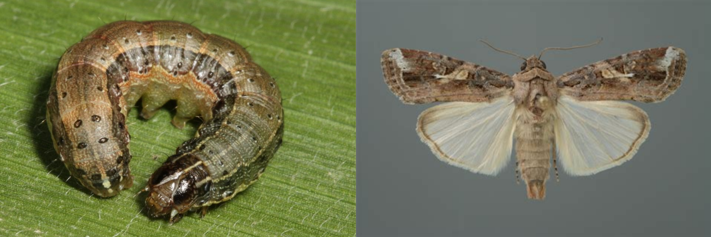
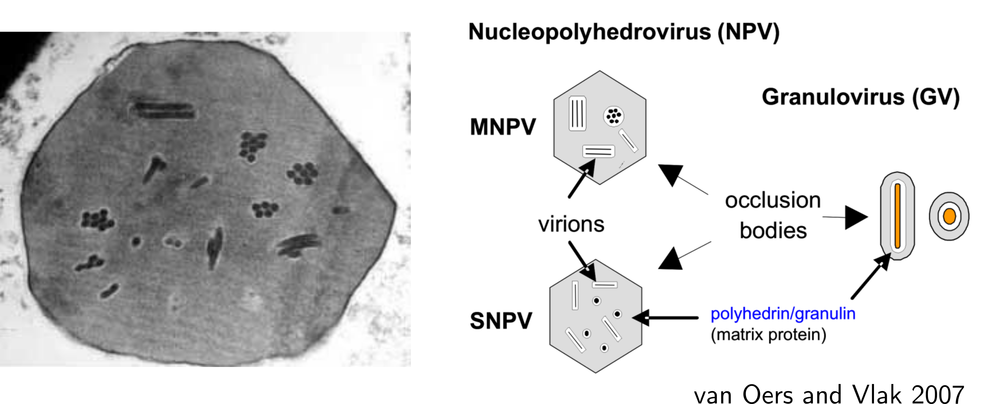

# Introducción

## Cogollero del maíz (*Spodoptera frugiperda*)

{height=60%}

## Control biológico de plagas

{height=60%}

## Baculovirus

::: columns

:::: column
- Genoma circular a DNA con un tamaño de 80 a 200 Kpb
- Codifican entre 60 y 180 genes
- Rango de hospedador estrecho
- Potencial como biopesticidas para el control de diversas plagas
::::

:::: column
{height=40%}
::::
:::

## Estructura del virión baculoviral

{height=80%}

## Ciclo biologico baculovirus

{height=80%}

## Baculovirus para el control de *S. frugiperda*

::: columns

:::: column
{height=40%}
::::

:::: column
{height=40%}
::::
:::

## Fundamento y alcance de este trabajo

Buscamos investigar los factores moleculares involucrados en la adaptación de SfGV y SfMNPV al cogollero del maíz, con el fin de comprender las bases de su virulencia.

## Objetivos específicos

- Caracterizar el proteoma de los OB de SfGV y EpapGV, dos granulovirus con propiedades infectivas disímiles
- Investigar la diversidad genética presente en un aislamiento argentino de SfMNPV
- Evaluar la capacidad infectiva de SfGV en la línea celular Sf9

# Proteóma de los cuerpos de oclusión de granulovirus

## Metodología experimental para el estudio del proteoma de granulovirus

{height=70%}

## Proteoma de los cuerpos de oclusión de EpapGV y SfGV 

::: columns

:::: column

EpapGV

{height=80%}

::::

:::: column

SfGV

{height=80%}

::::

:::

## Región colineal conservada en baculovirus

{height=70%}

## Homólogo de *ac-110* presente en EpapGV

{height=70%}

## Posible proteína de fusión Epap48-Epap49

{height=80%}

## Conservación evolutiva del proteoma de OB en granulovirus

{height=80%}

## Modelo semi-cuantitativo del proteoma de granulovirus

{height=70%}

## Spfr101, una posible proteína amiloide?

::: columns

:::: column
{height=70%}
::::

:::: column
{height=70%}
::::
:::

# Diversidad genómica en una población de SfMNPV

## Variantes puntuales presentes en el aislamiento argentino de SfMNPV

{height=70%}

## Variantes estructurales detectadas en SfMNPV-M

{height=70%}

## Diversidad genética presente en aislamientos geográficos de SfMNPV

{height=70%}

## Diversidad genética presente en el proteoma de SfMNPV

{height=70%}

## Evolución molecular de Sf29, una posible colagenasa

{height=70%}

# Estudio de la replicación de SfGV en cultivo celular

## Preparación de DNA viral para transfección en cultivo celular

{height=70%}

## Transfección de células Sf9 con AcMNPV-DsRed

{height=70%}

## Transfección de células Sf9 con SfGV

{height=70%}

## Expresión temprana en células transfectadas con SfGV

{height=70%}

## Cuantificación de los niveles de DNA por qPCR 

{height=70%}

## Construcciones auxiliares para mejorar la replicación de SfGV

{height=70%}

# Conclusiones

# Perspectivas

- Validar experimentalmente la presencia del producto de fusión Epap48-49 mediante el uso de anticuerpos específicos contra Epap48 o Epap49.

- Realizar los ensayos de purificación por afinidad seguida de análisis por espectrometría de masas para caracterizar los posibles interactores celulares de Epap95/Spfr101. 

- Confirmar mediante expresión, purificación y ensayo bioquímico si el gen *sf29* de SfMNPV codifica una proteína con actividad peptidasa.

- Secuenciar y caracterizar los polimorfismos presentes dentro de distintos aislamientos geográficos y temporales de SfMNPV en Argentina.

- Mejorar la reproducibilidad en la extracción de DNA total desde cultivo celular previo a la reacción de qPCR.

- Evaluar mediante ensayos de co-transfección si los plásmidos de expresión de genes sinergizantes son capaces de incrementar los niveles de replicación viral en cultivo celular.

# Agradecimientos
